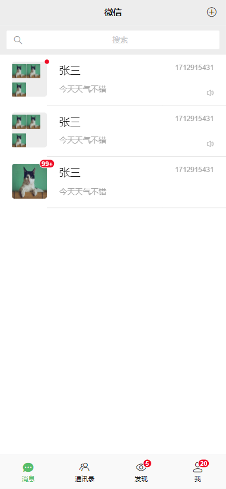
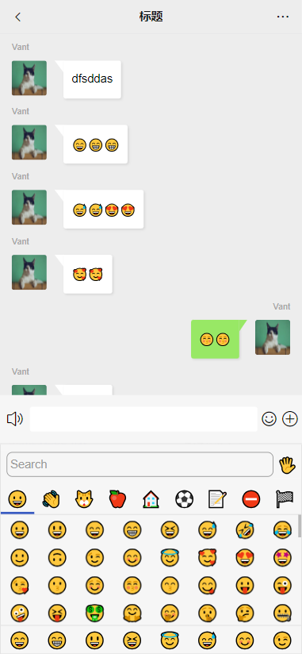
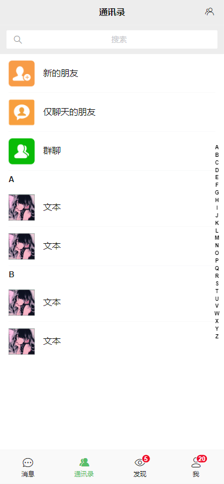

# <center>仿微信服务端接口</center>

在线体验：http://47.94.250.51:5173

客户端传送门：https://github.com/Juenfy/cover-wechat-client
### 项目介绍
技术栈：lumen+workerman
目前实现的功能：
1. 注册登录
2. 好友查找、申请、添加
3. 私聊、群聊（目前仅支持文本和表情）
4. 消息气泡通知
5. 扫码（暂时没域名，搞不了 https，所以用不了）
6. 个人信息
7. 拍照更换头像、选择相册更换头像
8. 等等其他小功能
会一直持续更新！！！

### 项目运行

导入数据库cover_wechat.sql
改好env配置

```shell
git clone https://github.com/Juenfy/cover-wechat-api.git
```

```shell
cd cover-wechat-backend
```

```shell
composer install
```

启动workerman服务

windows直接点击运行start_for_win.bat

linux运行
```shell
php artisan workerman start --start=all --d
```

运行项目
```shell
php -S localhost:8000 -t public
```

### 项目预览
聊天列表：


聊天详情：


通讯录：


好好享受吧！！！
